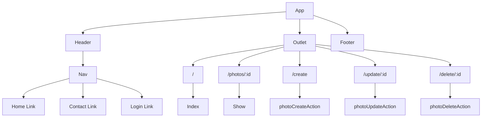

# Photography Portfolio

This Vue application boasts a sleek frontend interface that offers users an array of features to manage their photo collection with ease. From viewing to creating, deleting, and updating photos, users have complete control over their media library. The application prioritizes user security by requiring authorization to access and manipulate photo data. Its intuitive interface design ensures effortless navigation, empowering users to efficiently manage their favorite photos. What's more, the app integrates with a robust backend service to guarantee secure storage and retrieval of event data.

Technologies Used
- Vue
- Javascript
- CSS
- HTML

## Component Architecture

## Frontend Route Table
|    Route    | Element |    Loader   |       Action      |              Description                     |
|-------------|---------|-------------|-------------------|----------------------------------------------|
|      /      |  Index  | indexLoader |                   | Loads up list of photos                      |
| /photo/:id  |  Show   | photoLoader |                   | Loads up a specific photo                    |
|   /create   |  Create |             | photoCreateAction | Handles submission of create form for photos |
| /update/:id |  Update |             | photoUpdateAction | Handles submission of update form for photos |
| /delete/:id |  Delete |             | photoDeleteAction | Handles submission of delete form for photos |

## Mockups

### Desktop Mockup

### Mobile Mockup

 

### [Deployed Website]()

### [Trello Board](https://trello.com/invite/b/IkEQGiQD/ATTI4be5defd1ea9698676fa47a07ddeb7b59E0B1348/workspace)